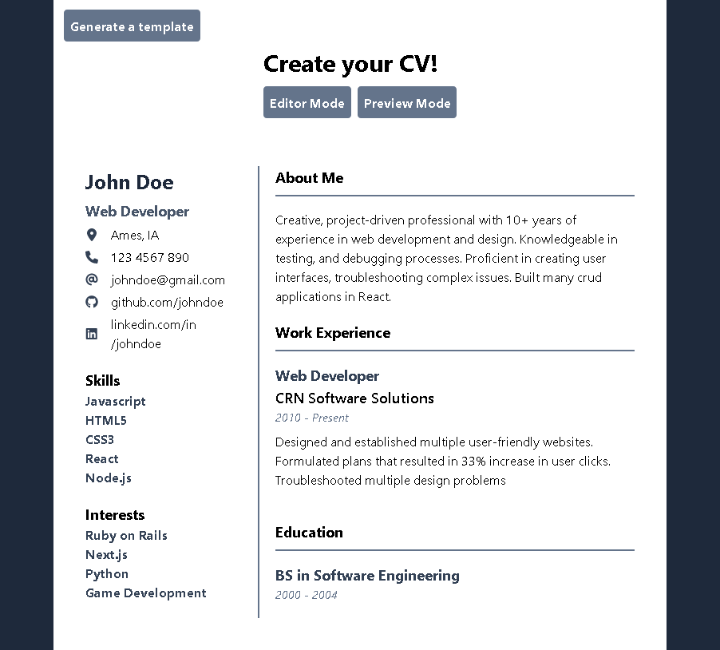

# cv-application

CV-Application project for The Odin Project. Made with React.

## Demo

## Screenshots

## Lessons Learned

This was my first React project and it was really tough passing data from parent to child and vice versa. React is super versatile and I'm loving it so far. I have no clue of best practices yet which you can probably tell from my code :sweat_smile: I will go back to it and fix these problems as I learn more about react. This project solidified my learnings about states, components, how to handle inputs, and rendering data. I will study some more in order to improve how I utilize them, to reduce code smells as well.

## Acknowledgements

- [The Odin Project](https://www.theodinproject.com/)

## TODO

- App
  - [ ] make app look better!
  - [ ] be able to convert to pdf
  - [x] Header
  - [x] Main
    - [x] LeftMain
      - [x] PersonalInfo
        - [x] Name
        - [x] Current Role
        - [x] Address
        - [x] Phone
        - [x] Email
        - [x] Github
        - [x] LinkedIn
      - [x] Skills
      - [x] Interests
    - [x] RightMain
      - [x] About
      - [x] Work Experience
        - [x] Role
        - [x] Company
        - [x] Date
        - [x] Achievements/Description
      - [x] Education
        - [x] Degree
        - [x] School Name
        - [x] Date
